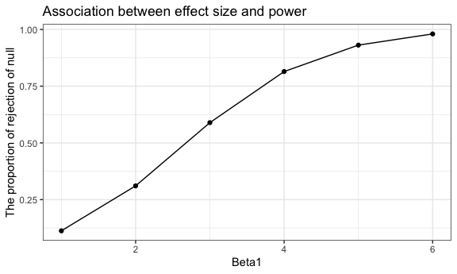
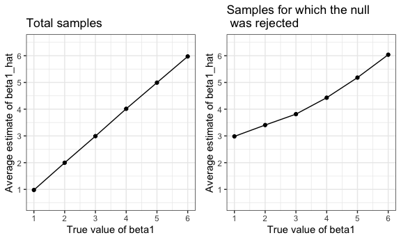

p8105\_hw5\_yl4358
================
YI LIU
11/10/2019

# Problem 1

``` r
set.seed(10)

iris_with_missing = iris %>% 
  map_df(~replace(.x, sample(1:150, 20), NA)) %>%
  mutate(Species = as.character(Species))

replace_iris_na = function(x_arg){
  if (is.numeric(x_arg)) {
   x_arg = replace(x_arg, is.na(x_arg), mean(x_arg,na.rm = TRUE))
  } else {
   x_arg = replace(x_arg, is.na(x_arg), "virginica") 
  }
}

output_iris = vector("list", length = 5)

for (i in 1:5) {
  
  output_iris[[i]] = replace_iris_na(x_arg = iris_with_missing[[i]])
}

final_iris = bind_cols(output_iris)
final_iris %>% 
 head(10) %>% 
  knitr::kable(digits = 2) 
```

|   V1 |  V2 |   V3 |   V4 | V5     |
| ---: | --: | ---: | ---: | :----- |
| 5.10 | 3.5 | 1.40 | 0.20 | setosa |
| 4.90 | 3.0 | 1.40 | 0.20 | setosa |
| 4.70 | 3.2 | 1.30 | 0.20 | setosa |
| 4.60 | 3.1 | 1.50 | 1.19 | setosa |
| 5.00 | 3.6 | 1.40 | 0.20 | setosa |
| 5.40 | 3.9 | 1.70 | 0.40 | setosa |
| 5.82 | 3.4 | 1.40 | 0.30 | setosa |
| 5.00 | 3.4 | 1.50 | 0.20 | setosa |
| 4.40 | 2.9 | 1.40 | 0.20 | setosa |
| 4.90 | 3.1 | 3.77 | 0.10 | setosa |

``` r
output_iris_map = map_df(iris_with_missing, replace_iris_na)

output_iris_map %>% 
 head(10) %>% 
  knitr::kable(digits = 2) 
```

| Sepal.Length | Sepal.Width | Petal.Length | Petal.Width | Species |
| -----------: | ----------: | -----------: | ----------: | :------ |
|         5.10 |         3.5 |         1.40 |        0.20 | setosa  |
|         4.90 |         3.0 |         1.40 |        0.20 | setosa  |
|         4.70 |         3.2 |         1.30 |        0.20 | setosa  |
|         4.60 |         3.1 |         1.50 |        1.19 | setosa  |
|         5.00 |         3.6 |         1.40 |        0.20 | setosa  |
|         5.40 |         3.9 |         1.70 |        0.40 | setosa  |
|         5.82 |         3.4 |         1.40 |        0.30 | setosa  |
|         5.00 |         3.4 |         1.50 |        0.20 | setosa  |
|         4.40 |         2.9 |         1.40 |        0.20 | setosa  |
|         4.90 |         3.1 |         3.77 |        0.10 | setosa  |

# Problem 2

``` r
long_df = tibble(
  file_names = list.files(path = "./data"),
  file_path = str_c("./data/", file_names)
  ) %>% 
  mutate(
    observation_df = map(file_path, read_csv)
  ) %>% 
  unnest() %>% 
  select(-file_path) %>% 
  separate(col = file_names, into = c("arm", "subject_id"), sep = "_") %>%
  mutate(
    arm = recode(arm, "con" = "control" , "exp" = "experimental"),
    subject_id = str_replace(subject_id, ".csv", " ")
  ) %>% 
  pivot_longer(
    week_1:week_8,
    names_to = "week",
    names_prefix = "week_",
    values_to = "observation"
  )
```

    ## Parsed with column specification:
    ## cols(
    ##   week_1 = col_double(),
    ##   week_2 = col_double(),
    ##   week_3 = col_double(),
    ##   week_4 = col_double(),
    ##   week_5 = col_double(),
    ##   week_6 = col_double(),
    ##   week_7 = col_double(),
    ##   week_8 = col_double()
    ## )
    ## Parsed with column specification:
    ## cols(
    ##   week_1 = col_double(),
    ##   week_2 = col_double(),
    ##   week_3 = col_double(),
    ##   week_4 = col_double(),
    ##   week_5 = col_double(),
    ##   week_6 = col_double(),
    ##   week_7 = col_double(),
    ##   week_8 = col_double()
    ## )
    ## Parsed with column specification:
    ## cols(
    ##   week_1 = col_double(),
    ##   week_2 = col_double(),
    ##   week_3 = col_double(),
    ##   week_4 = col_double(),
    ##   week_5 = col_double(),
    ##   week_6 = col_double(),
    ##   week_7 = col_double(),
    ##   week_8 = col_double()
    ## )
    ## Parsed with column specification:
    ## cols(
    ##   week_1 = col_double(),
    ##   week_2 = col_double(),
    ##   week_3 = col_double(),
    ##   week_4 = col_double(),
    ##   week_5 = col_double(),
    ##   week_6 = col_double(),
    ##   week_7 = col_double(),
    ##   week_8 = col_double()
    ## )
    ## Parsed with column specification:
    ## cols(
    ##   week_1 = col_double(),
    ##   week_2 = col_double(),
    ##   week_3 = col_double(),
    ##   week_4 = col_double(),
    ##   week_5 = col_double(),
    ##   week_6 = col_double(),
    ##   week_7 = col_double(),
    ##   week_8 = col_double()
    ## )
    ## Parsed with column specification:
    ## cols(
    ##   week_1 = col_double(),
    ##   week_2 = col_double(),
    ##   week_3 = col_double(),
    ##   week_4 = col_double(),
    ##   week_5 = col_double(),
    ##   week_6 = col_double(),
    ##   week_7 = col_double(),
    ##   week_8 = col_double()
    ## )
    ## Parsed with column specification:
    ## cols(
    ##   week_1 = col_double(),
    ##   week_2 = col_double(),
    ##   week_3 = col_double(),
    ##   week_4 = col_double(),
    ##   week_5 = col_double(),
    ##   week_6 = col_double(),
    ##   week_7 = col_double(),
    ##   week_8 = col_double()
    ## )
    ## Parsed with column specification:
    ## cols(
    ##   week_1 = col_double(),
    ##   week_2 = col_double(),
    ##   week_3 = col_double(),
    ##   week_4 = col_double(),
    ##   week_5 = col_double(),
    ##   week_6 = col_double(),
    ##   week_7 = col_double(),
    ##   week_8 = col_double()
    ## )
    ## Parsed with column specification:
    ## cols(
    ##   week_1 = col_double(),
    ##   week_2 = col_double(),
    ##   week_3 = col_double(),
    ##   week_4 = col_double(),
    ##   week_5 = col_double(),
    ##   week_6 = col_double(),
    ##   week_7 = col_double(),
    ##   week_8 = col_double()
    ## )
    ## Parsed with column specification:
    ## cols(
    ##   week_1 = col_double(),
    ##   week_2 = col_double(),
    ##   week_3 = col_double(),
    ##   week_4 = col_double(),
    ##   week_5 = col_double(),
    ##   week_6 = col_double(),
    ##   week_7 = col_double(),
    ##   week_8 = col_double()
    ## )
    ## Parsed with column specification:
    ## cols(
    ##   week_1 = col_double(),
    ##   week_2 = col_double(),
    ##   week_3 = col_double(),
    ##   week_4 = col_double(),
    ##   week_5 = col_double(),
    ##   week_6 = col_double(),
    ##   week_7 = col_double(),
    ##   week_8 = col_double()
    ## )
    ## Parsed with column specification:
    ## cols(
    ##   week_1 = col_double(),
    ##   week_2 = col_double(),
    ##   week_3 = col_double(),
    ##   week_4 = col_double(),
    ##   week_5 = col_double(),
    ##   week_6 = col_double(),
    ##   week_7 = col_double(),
    ##   week_8 = col_double()
    ## )
    ## Parsed with column specification:
    ## cols(
    ##   week_1 = col_double(),
    ##   week_2 = col_double(),
    ##   week_3 = col_double(),
    ##   week_4 = col_double(),
    ##   week_5 = col_double(),
    ##   week_6 = col_double(),
    ##   week_7 = col_double(),
    ##   week_8 = col_double()
    ## )
    ## Parsed with column specification:
    ## cols(
    ##   week_1 = col_double(),
    ##   week_2 = col_double(),
    ##   week_3 = col_double(),
    ##   week_4 = col_double(),
    ##   week_5 = col_double(),
    ##   week_6 = col_double(),
    ##   week_7 = col_double(),
    ##   week_8 = col_double()
    ## )
    ## Parsed with column specification:
    ## cols(
    ##   week_1 = col_double(),
    ##   week_2 = col_double(),
    ##   week_3 = col_double(),
    ##   week_4 = col_double(),
    ##   week_5 = col_double(),
    ##   week_6 = col_double(),
    ##   week_7 = col_double(),
    ##   week_8 = col_double()
    ## )
    ## Parsed with column specification:
    ## cols(
    ##   week_1 = col_double(),
    ##   week_2 = col_double(),
    ##   week_3 = col_double(),
    ##   week_4 = col_double(),
    ##   week_5 = col_double(),
    ##   week_6 = col_double(),
    ##   week_7 = col_double(),
    ##   week_8 = col_double()
    ## )
    ## Parsed with column specification:
    ## cols(
    ##   week_1 = col_double(),
    ##   week_2 = col_double(),
    ##   week_3 = col_double(),
    ##   week_4 = col_double(),
    ##   week_5 = col_double(),
    ##   week_6 = col_double(),
    ##   week_7 = col_double(),
    ##   week_8 = col_double()
    ## )
    ## Parsed with column specification:
    ## cols(
    ##   week_1 = col_double(),
    ##   week_2 = col_double(),
    ##   week_3 = col_double(),
    ##   week_4 = col_double(),
    ##   week_5 = col_double(),
    ##   week_6 = col_double(),
    ##   week_7 = col_double(),
    ##   week_8 = col_double()
    ## )
    ## Parsed with column specification:
    ## cols(
    ##   week_1 = col_double(),
    ##   week_2 = col_double(),
    ##   week_3 = col_double(),
    ##   week_4 = col_double(),
    ##   week_5 = col_double(),
    ##   week_6 = col_double(),
    ##   week_7 = col_double(),
    ##   week_8 = col_double()
    ## )
    ## Parsed with column specification:
    ## cols(
    ##   week_1 = col_double(),
    ##   week_2 = col_double(),
    ##   week_3 = col_double(),
    ##   week_4 = col_double(),
    ##   week_5 = col_double(),
    ##   week_6 = col_double(),
    ##   week_7 = col_double(),
    ##   week_8 = col_double()
    ## )

    ## Warning: `cols` is now required.
    ## Please use `cols = c(observation_df)`

``` r
long_df %>% 
  group_by(arm,subject_id) %>% 
  ggplot(aes(x = week, y = observation, group = subject_id, color = subject_id)) +
  geom_line() +
  labs(
    title = "Observation on each subject overtime",
    x = "Week",
    y = "Observation"
     ) +
  facet_grid(.~arm)
```


  - The obeservation in experimental group is increasing overtime while
    the observation in control group is stable. The obeservation in
    experimental group is relative higher than that in control group.

# Problem 3

## Conduct simulation when beta1=0

``` r
sim_regression = function(beta1) {
  
  sim_data = tibble(
    x = rnorm(30, mean = 0, sd = 1),
    y = 2 + beta1 * x + rnorm(30, 0, sqrt(50))
  )
  
ls_fit = 
  lm(y ~ x, data = sim_data) %>% 
   broom::tidy() 
tibble(
  beta1_hat = ls_fit[[2]][2],
  p_value = ls_fit[[5]][2]
)
}

output_beta10 = 
  rerun(10000, sim_regression(beta1 = 0)) %>% 
  bind_rows()
output_beta10 %>%
  head(10)
```

    ## # A tibble: 10 x 2
    ##    beta1_hat  p_value
    ##        <dbl>    <dbl>
    ##  1     2.02  0.207   
    ##  2     1.23  0.182   
    ##  3     0.603 0.606   
    ##  4     3.03  0.000149
    ##  5    -1.19  0.471   
    ##  6    -1.49  0.219   
    ##  7    -1.97  0.192   
    ##  8     0.331 0.769   
    ##  9     0.576 0.670   
    ## 10     2.40  0.134

## Conduct a simulation to explore power in a simple linear regression

``` r
sim_results =
  tibble(
  beta1_set = c(1,2,3,4,5,6)
) %>% 
  mutate(
    output_list = map(.x = beta1_set, ~rerun(10000, sim_regression(beta1 = .x))),
    output_df = map(output_list, bind_rows)
  ) %>% 
  select(-output_list) %>% 
  unnest(output_df)

sim_results %>% 
  mutate(
    rejection = ifelse(p_value < 0.05, 1, 0)
  ) %>% 
  group_by(beta1_set) %>% 
  summarize(
    reject_proportion = sum(rejection)/ length(p_value)
  ) %>% 
  ggplot(aes(x = beta1_set, y = reject_proportion)) +
  geom_point() +
  geom_line() +
  labs(
    title = "Association between effect size and power",
    x = "Beta1",
    y = "The proportion of rejection of null"
     )
```



  - The effect size has a positive effect on power. With the growth of
    effect size beta1, the power increases.

<!-- end list -->

``` r
avg_beta1_sim =
  sim_results %>% 
  group_by(beta1_set) %>% 
  summarize(
    avg_beta1_hat = mean(beta1_hat)
  ) %>% 
  ggplot(aes(x = beta1_set, y = avg_beta1_hat))+
  geom_point() +
  geom_line() +
   labs(
    title = "Total samples",
    x = "True value of beta1",
    y = "Average estimate of beta1_hat"
     )

avgrej_beta1_sim =
  sim_results %>% 
  filter(p_value < 0.05) %>% 
  group_by(beta1_set) %>% 
  summarize(
    avgrej_beta1_hat = mean(beta1_hat)
  ) %>% 
  ggplot(aes(x = beta1_set, y = avgrej_beta1_hat))+
  geom_point() +
  geom_line() +
    labs(
    title = "Samples for which the null was rejected",
    x = "True value of beta1",
    y = "Average estimate of beta1_hat"
     )

avg_beta1_sim + avgrej_beta1_sim
```


